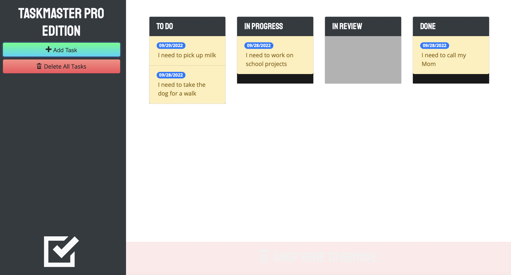

# TaskMaster Pro

### User Story

As a User, I would like a task manager app that I can use any day of the week.. When I load this app I should see a sidebar with teh option to add a task or delete a task. In the main section of the screen I should see all of my tasks, and I should see wether they are in TO DO, In Progress, In Review or Done states. I want to be able to drag these tasks to whatever column they should be in. When I add a task, I should see a new window appear to Add a task, this should ask me for a Task Description and will also allow me to pick a date using a calendar. If I delete a task it should be removed from my columns.

### Features
This web application features task manager tool 
This application will allow users to add or delete tasks.
These tasks can be moved to either columns: TO DO, In Progress, In Review, or Done
A User can add a new task, when they choose this, a new modal window will open and ask them for the task description, and to pick a date.
A user can also delete any task.
Tasks can be moved from one column to teh next by dragging.

### Badges

## Table of Contents

- [installation](#installation)
- [contribution guidelines](#contribution)
- [Test Instructions](#testing)
- [License](#license)
- [Questions](#questions)

### Installation
1. Please clone the github repo here :
https://github.com/Vinyldude8896/taskmaster-pro

### Contribution Guidelines
Current contributers:
Kevin Reid : https://github.com/Vinyldude8896  

### Testing
To test this app: 
1. Clone the repo here : https://github.com/Vinyldude8896/taskmaster-pro  
2. Right click the index.html file and open in browser.  
3. Try entering a task.
4. Try moving the task to another column by dragging it.
5. Try deleting a task.

### Questions
    email address : kevinnivek@me.com
    - additional instructions 
    I can be contacted by phone as well, but prefer email contact first.
### Images

### Live GitHub Page
link to website:  https://vinyldude8896.github.io/taskmaster-pro/
